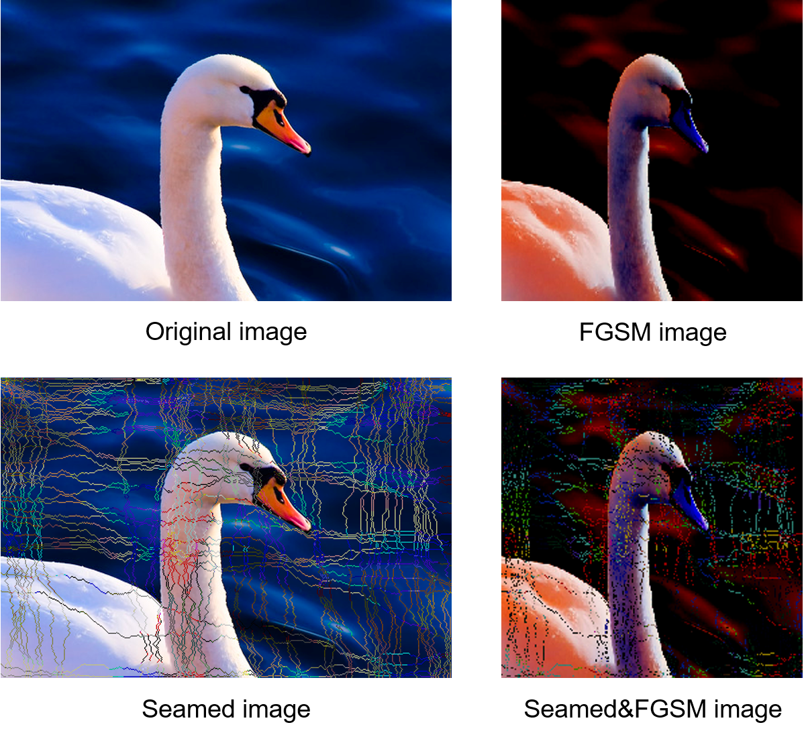
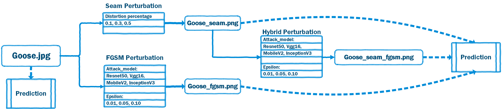

# Adversarial Machine Learning in Action

## Introduction
Welcome to the GitHub repository for my Master's dissertation, "Adversarial Machine Learning in Action: Attacking CNN Image Classifiers with FGSM and Seam Doppelganger on ImageNet." This project investigates the impact of adversarial attacks on Convolutional Neural Network (CNN) image classifiers trained on the ImageNet dataset.

### Motivation
In the era of deep learning, image recognition technologies are prevalent in various applications. However, the use of such technologies raises concerns about user privacy. This project explores adversarial attacks as a means of subtly manipulating input images to influence the performance of machine learning models.

## Technical Background
Before delving into the details of the adversarial attack methods, it's crucial to understand the broader landscape of machine learning and deep learning. This section covers advancements in machine learning, the role of GPU technology, data privacy and protection regulations, and the taxonomy of adversarial machine learning.

## My Approach
The core of the research lies in the proposed hybrid adversarial attack method, combining Fast Gradient Sign Method (FGSM) and Seam Doppelganger. The goal is to assess the effectiveness of this method in confusing pre-trained TensorFlow classifiers.

### Perturbation Methods
To create adversarial examples, two primary perturbation methods are employed: Seam Doppelganger and FGSM. The workflow for generating these examples involves careful consideration of each step.

1. **Data Selection:**
   - Identify a diverse set of images from the ImageNet dataset.
   
2. **Hypothesis Formulation:**
   - Clearly define the research hypothesis regarding the impact of hybrid adversarial attacks on classifier performance.

3. **Seam Doppelganger:**
   - Implement the seam-carving technique to subtly modify images, preserving their original semantics.
   
4. **FGSM:**
   - Apply the Fast Gradient Sign Method to generate adversarial examples by perturbing image pixels.

5. **Hybrid Attack:**
   - Combine the outputs of Seam Doppelganger and FGSM to create a hybrid adversarial attack.

6. **Prediction and Evaluation:**
   - Feed the adversarial examples to pre-trained TensorFlow classifiers and evaluate their accuracy.

## Critical Evaluation
Understanding the impact of adversarial attacks is essential. This section critically evaluates the effectiveness of the hybrid attack method on machine learning models.

### Adversarial Training
To enhance model robustness, the study explores the retraining of models on hybrid adversarial examples. The validation of the research hypothesis is a key aspect of this phase.

## Conclusion
Summarizing the findings, the conclusion discusses the current project status, outlines potential future work, and provides a high-level summary of key results.

## Image Examples
Below are visual examples showcasing the impact of adversarial attacks on images:

 

*Note: The images above illustrate the effectiveness of the hybrid adversarial attack method in influencing classifier predictions.*

*Note: The image above provides a visual guide on how to generate perturbed images.*

## Repository Structure
- **Code:** Contains Python scripts and orchestration files.
- **Data:** Includes datasets used in the study.
- **Results:** Stores visualizations and analysis results.
- **Docs:** Supplementary documents related to the project.

Feel free to explore the code, datasets, and results to gain a deeper understanding of the research. If you have any questions or feedback, don't hesitate to reach out.

## Acknowledgements
I express my gratitude to Dr. James Pope, my supervisor, for guidance throughout the research process.

---

*Note: This README provides detailed steps and includes visual examples of adversarial attacks on images. Refer to the dissertation for in-depth details and analysis.*
